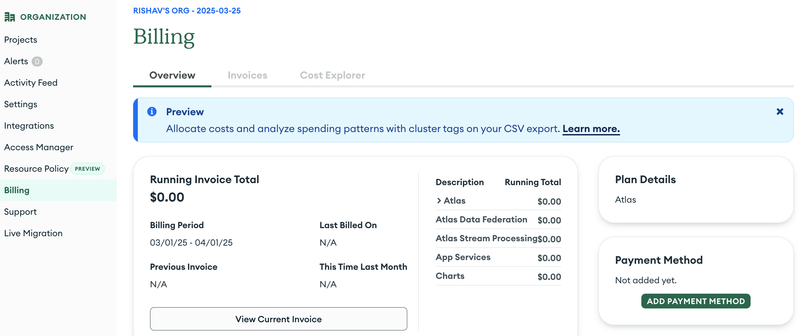
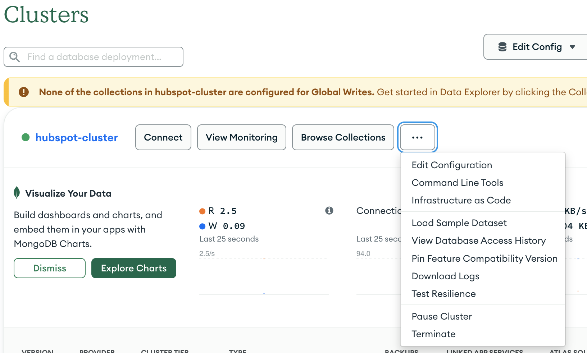
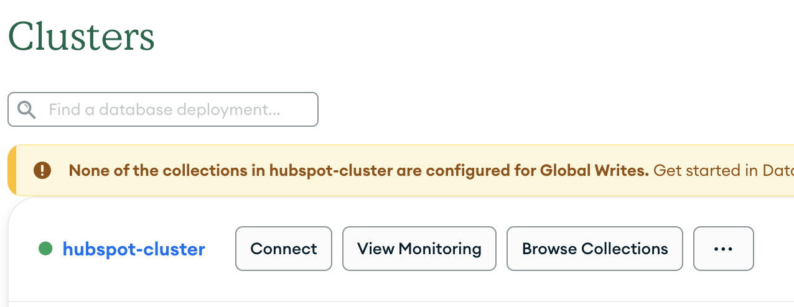
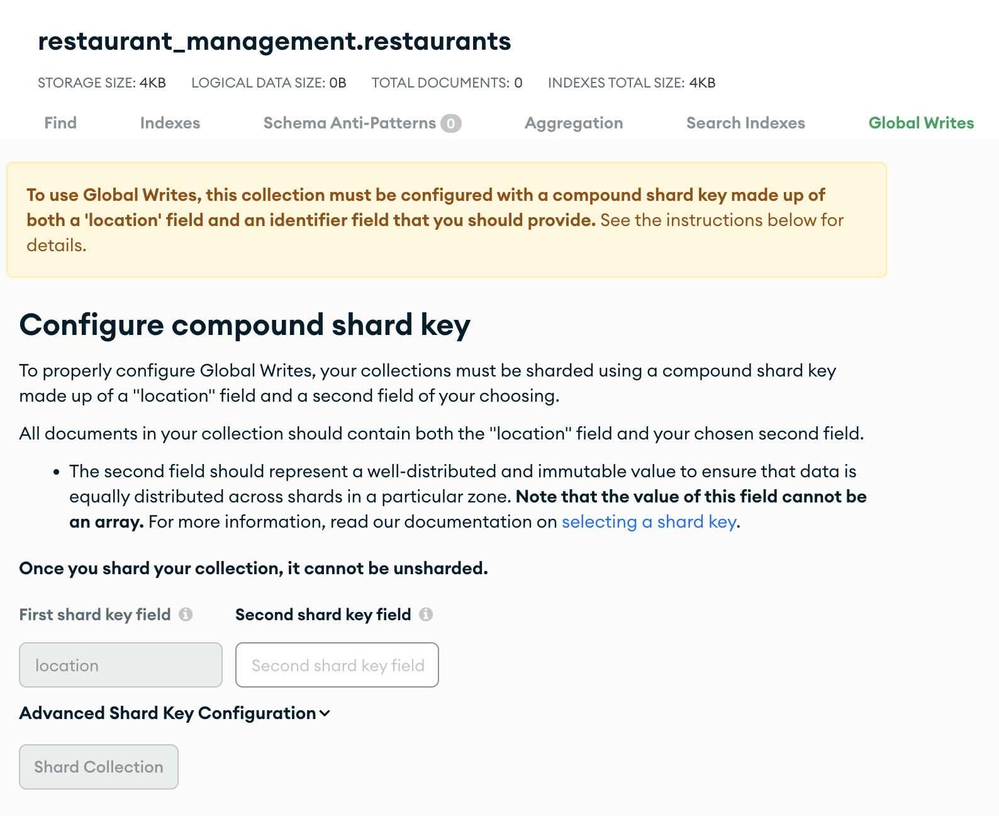
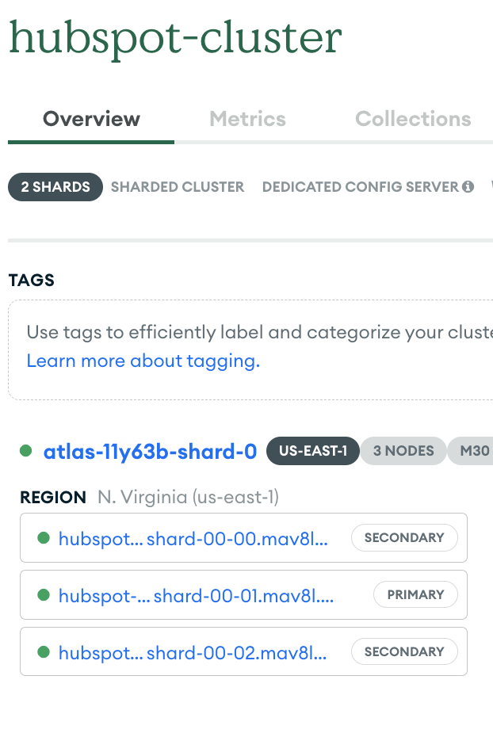

# Multi Region Setup: MongoDB Atlas

This guide walks you through installing the CLI, setting up your Atlas project, configuring a multi-region geo-sharded cluster, and finally connecting and interacting with your database.

It is useful to look at the changes along in the Atlas UI to get a feel for how the CLI commands are updating your project and cluster.

## Notes

1. There are cost implications of setting up a MongoDB Atlas Cluster. To avoid unnecessary charges, ensure the cluster is paused or terminated when it is not in use.

2. These steps are designed to complement the guidance provided in the HubSpot Developer Blog article, "Minimizing Latency: A Guide to High‑Performance App Cards on HubSpot."

3. The steps below were executed on a MacOS operating system. Links will be provided to external docs wherever possible that can assist with identifying the steps for a different OS.

## Steps

1.  **Install the Atlas CLI and MongoDB Shell**

    Atlas CLI is a command-line tool for managing your MongoDB Atlas infrastructure, including clusters, network access, and backups.

    The MongoDB Shell (or [mongosh](https://www.mongodb.com/docs/mongodb-shell/#mongodb-binary-bin.mongosh)) is used to test queries and interact with the data in your MongoDB database.

    This CLI command installs the Atlas CLI as well as `mongosh` using [homebrew](https://brew.sh/).

    ```bash
    brew install mongodb-atlas-cli
    ```

    You can verify the installation by running the following commands:

    ```bash
    atlas --version;
    mongosh --version;
    ```

    MongoDB Atlas CLI Docs: https://www.mongodb.com/docs/atlas/cli/current/

---

2.  **Set Up Your Atlas Account and Project**

    *   Log in: Sign in to your Atlas account here: https://account.mongodb.com/account/login or register on https://account.mongodb.com/account/register.
    *   Once you complete your account registration and login, you will see that a MongoDB project has been automatically created for you.
    *   If you are an existing MongoDB user, you may want to create a new project using the Atlas UI.

    MongoDB Project Docs: https://www.mongodb.com/docs/cloud-manager/tutorial/manage-projects/

---

3.  **Define Environment Variables**

    Choose a cluster name, profile, and database user as environment variables in your CLI. We'll be using these in subsequent CLI commands.

    ```bash
    CLUSTER_NAME=hubspot-cluster
    PROFILE=hubspot
    DB_USER=admin
    ```

    You can save your frequently-used connection settings as profiles. Learn more about profiles here: https://www.mongodb.com/docs/atlas/cli/current/atlas-cli-save-connection-settings

4.  **Authenticate with the Atlas CLI**

    Log in using your CLI credentials using the profile we specified above:

    ```bash
    atlas auth login --profile $PROFILE
    ```

    The authentication process may configure the organization and project mapped to this profile, or you may be asked to select your organization and project from the list.

    Run the following command to verify that your profile is configured to the MongoDB project you created in Step 2.

    ```bash
    atlas config describe $PROFILE
    ```

5. **Setup Payment Method**

    Navigate to Billing page of your organization and set up a payment method.

    

    MongoDB Billing Details: https://www.mongodb.com/docs/atlas/billing/
    MongoDB Pricing Details: https://www.mongodb.com/pricing

    We will be setting up a M30 Size Dedicated Cluster here (specifications are on the next step). More details about dedicated clusters are here: https://www.mongodb.com/docs/atlas/create-database-deployment/#dedicated-clusters

6.  **Create the Cluster Configuration File**

    Let's navigate to a new folder first.

    ```bash
    mkdir -p uie-multi-region-backend && cd $_
    ```

    This command below saves the following JSON configuration to a file (`mongodb-cluster-config-v0.json`).

    This file defines a geo-sharded cluster with regional configurations (one region in US_EAST_1 and another in EU_CENTRAL_1 in this case).

    ```json
    echo '{
      "replicationSpecs": [
        {
          "numShards": 1,
          "regionConfigs": [
            {
              "electableSpecs": {
                "instanceSize": "M30",
                "nodeCount": 3
              },
              "priority": 7,
              "providerName": "AWS",
              "regionName": "US_EAST_1"
            }
          ],
          "zoneName": "us-east-1"
        },
        {
          "numShards": 1,
          "regionConfigs": [
            {
              "electableSpecs": {
                "instanceSize": "M30",
                "nodeCount": 3
              },
              "priority": 7,
              "providerName": "AWS",
              "regionName": "EU_CENTRAL_1"
            }
          ],
          "zoneName": "eu-central-1"
        }
      ],
      "clusterType": "GEOSHARDED",
      "diskSizeGB": 40,
      "globalClusterSelfManagedSharding": false
    }' > mongodb-cluster-config-v0.json
    ```

7.  **Create the Cluster**

    Use the Atlas CLI to create your cluster with the specified configuration:

    ```bash
    atlas clusters create $CLUSTER_NAME -f mongodb-cluster-config-v0.json -P $PROFILE
    ```

    You should see a message like:

    ```bash
    Cluster 'hubspot-cluster' is being created.
    ```

    Cluster creation typically takes about 10 minutes.
    You can monitor the progress in the Atlas UI under the Clusters tab.

8. **View cluster configuration and pricing**

    You can click on "Edit Configuration" in the Clusters tab to visualize the configuration and also check the estimated pricing per hour.

    

9.  **Configure Network Access**

    Create an access list entry to allow connections from any IP address (for testing).

    **Note:** For production use cases, restrict access to specific IP ranges.

    ```bash
    atlas accessLists create 0.0.0.0/0 --type cidrBlock -P $PROFILE --comment "Allow all (NOT RECOMMENDED)"
    ```

10. **Create a Database User**

    Create a user with administrative privileges.

    ```bash
    atlas dbusers create atlasAdmin --username $DB_USER -P $PROFILE
    ```

    You'll be prompted to set a password.

11. **Retrieve the Connection String**

    Get the MongoDB connection string required to connect to your cluster:


    The commend below requires [jq](https://jqlang.org/). You can install it using `brew install jq`.

    ```bash
    CONNECTION_STRING=$(atlas clusters connectionString describe "$CLUSTER_NAME" -P $PROFILE --output json | jq -r '.standardSrv')
    ```

    If you don't prefer to install `jq`, you can run the command, and set the `CONNECTION_STRING` variable manually to the value of `standardSrv` in the response.

12. **Connect to Your Database**

    Launch the Mongo DB Shell using the connection string and your database user credentials:

    ```bash
    mongosh $CONNECTION_STRING --apiVersion 1 --username $DB_USER
    ```

    You can now interact with your MongoDB database.

13. **Create a Database and Collection**

    In the MongoDB Shell, switch to a new database and create a collection:

    ```javascript
    use restaurant_management
    ```
    ```javascript
    db.createCollection("restaurants")
    ```

14. **Enable Global Writes for Your Collection**

    From the Atlas UI, click on Browse Collections and navigate to the "restaurants" collection.

    

    Click on "Global Writes"

    

    Enter `postalCode` as your second shard key field and click 'Shard Collection'.

    What we've done here so far helps Atlas stores restaurants in an appropriate shard based on the location of the restaurant.

    Note that the `location` attribute must be a ISO 3166-1 Alpha-2 country code.

15. **Insert Sample Data**

    Insert sample documents into your restaurants collection:

    ```javascript
    db.restaurants.insertMany([
      {
        location: "US",
        postalCode: "90210",
        name: "Spago",
        cuisine: "Californian",
      },
      {
        location: "FR",
        postalCode: "75008",
        name: "L'Arpège",
        cuisine: "French",
      },
      {
        location: "JP",
        postalCode: "104-0061",
        name: "Sukiyabashi Jiro",
        cuisine: "Sushi",
      }
    ]);
    ```

16. **Query the Collection**

    Test data retrieval by querying the collection. For example, to find restaurants in France with postal codes between 75000 and 75999:

    ```javascript
    db.restaurants.find({ location: "FR", postalCode: { $gte: "75000", $lte: "75999" } })
    ```

17. **Verify Data Distribution across Regions**

    Ensure that your data is correctly distributed across shards by looking at the execution stats in the MongoDB Shell.

    ```javascript
    var result = db.restaurants.find({ location: "US" }).explain("executionStats");

    result.executionStats.executionStages.shards.forEach(shard => {
        print(shard.shardName);
    });
    ```

    You can visit the cluster page in Atlas UI to identify the geographical zone the shard maps to.

    

    You can repeat the steps for restaurants in "JP" region to verify that they are sharded to the correct geographical zone.

18. **Pause or Terminate Cluster**

    Gentle reminder to Pause or Terminate your cluster from the Cluster detail page if you decide to continue playing around with this later!

## What's next?

  Congratulations! You have successfully setup a regionally sharded MongoDB Atlas cluster!

  Our database is now ready to be used in our application.

  Head over to the Vercel setup steps where we use this database to build our multi-region restaurant application.

