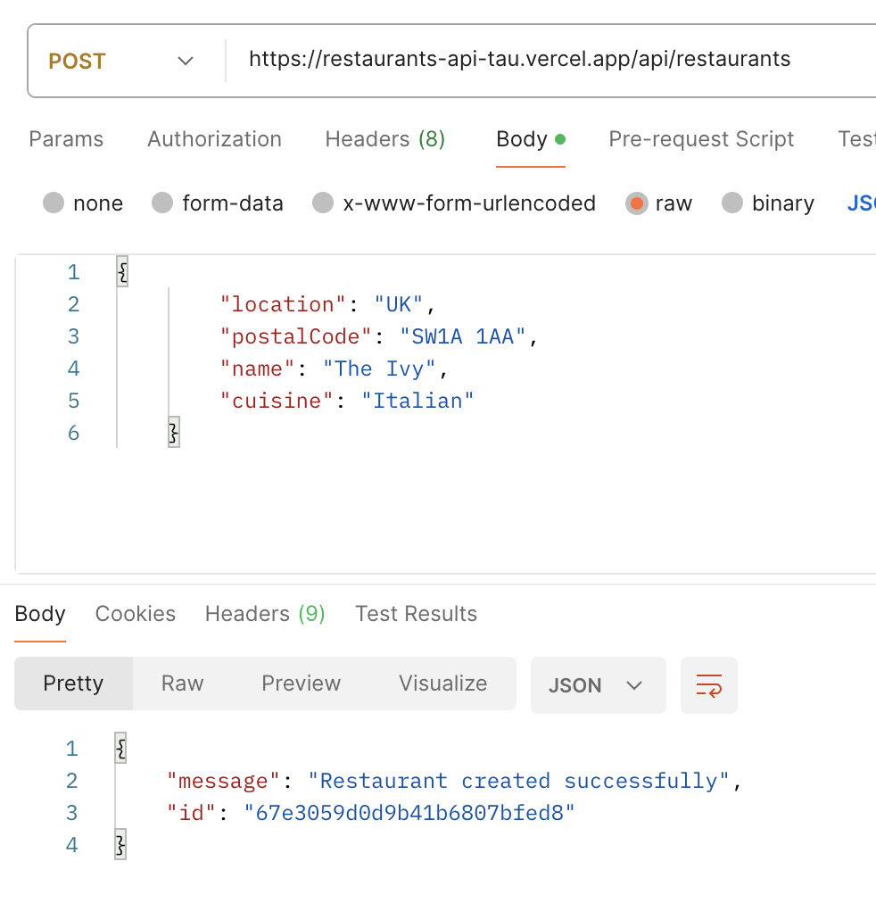

# Multi Region Setup: Vercel

[Vercel](https://vercel.com/docs) provides a serverless hosting solution for APIs, where requests are handled by Serverless Functions running on AWS Lambda, automatically scaling based on demand. These functions are globally distributed across Vercel’s [Edge Network](https://vercel.com/docs/edge-network), ensuring low-latency responses by serving requests from the nearest data center.
Getting Started

## Notes

1. These steps assume that you've already setup the Mongo DB Cluster and `restaurants` collection, as described [here](../mongodb-atlas/README.md)

## Steps

1.  **Setup an account on Vercel**
    Visit vercel.com/signup to create your account.

2. **Install the Vercel CLI**

    ```bash
    npm i -g vercel
    ```
3. **Login to your account in the CLI**
    ```bash
    vercel login
    ```

    Follow the steps to complete your login process.

4. **Clone repo and link to Vercel Project**

    You can clone the [`vercel`](../vercel/) folder locally for the serverless function source code and run `npm install`.

    Run the following from inside the `vercel` folder. Specify a project name and complete the linking.

    ```bash
    vercel link
    ```

5. **Identify MongoDB Connection URI**

    Navigate to the clusters page in the Atlas UI. Click Connect -> Drivers, and you should see a screen like this.

    

    Copy the connection string, and replace the `db_password` with the password you had setup in [Step #10](../mongodb-atlas/README.md#create-a-database-user) of the MongoDB Setup process.

    If you've forgotten the password, or want to change it, you can visit the Database Access section of the Atlas UI, or use the Atlas CLI.

6. **Set MongoDB URI Vercel Env Var**

    Run this command to add the MongoDB URI To the Vercel Env.

    ```bash
    vercel env add MONGODB_URI
    ```

    You can choose to add it to all environments for this test, but we'll only be testing the service in `Production` here.

7. **Configure Vercel Edge Network Regions**

    You can modify the `vercel.json` configuration to run your function in more than one [region](https://vercel.com/docs/edge-network/regions). Note that you may need to upgrade to the Pro or Enterprise plan to do so.

8. **Deploy your function**

    Run this command to deploy our function to Production.

    ```bash
    vercel --prod
    ```

    Obtain the domain of your Vercel API by visiting your Project page in Vercel.

    

    We can now use the Postman client to make requests to create and search for restaurants at the `https://<your-vercel-domain>/api/restaurants` endpoint.

9. **Testing the API**

    ***Creating Restaurants***

    You can now create restaurants in different regions of the world.

    Sample Request:

    POST `https://<your-vercel-domain>/api/restaurants`
    ```json
    {
        "location": "US",
        "postalCode": "98106",
        "name": "Cactus",
        "cuisine": "Mexican"
    }
    ```

    Sample request on Postman

    

    ***Searching Restaurants***

    You must specify the location , but the postalCode is optional.

    GET `https://<your-vercel-domain>/api/restaurants/api/restaurants?location=US&postalCode=98106`

## Congratulations!

You are now all set to plug in the Vercel API in your Hubspot UI Extension's `hubspot.fetch()` requests and start building blazing fast app cards!
